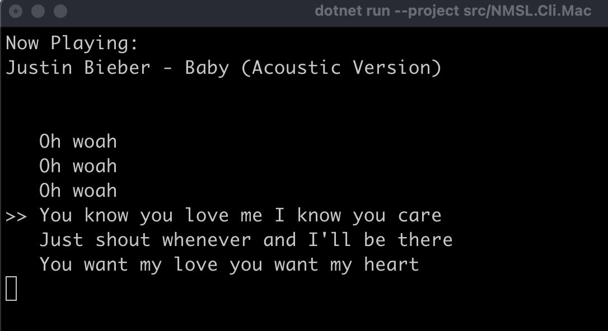

# OmniLyrics

OmniLyrics: A personal attempt to build the lyric tool I always wanted -- CLI, TUI, GUI, and cross-platform.

## Showcase

Windows Terminal (Default Mode):


macOS Terminal (Default Mode):



Linux Waybar (Line Mode, --mode line):


## Build Instruction
Download and Install [.NET SDK 8.0](https://dotnet.microsoft.com/en-us/download/dotnet/8.0)

Clone:
```bash
git clone https://github.com/zzxzzk115/OmniLyrics.git
```

Build and Run:
```bash
cd OmniLyrics

# Build the entire solution
dotnet build

# Launch the Windows CLI
dotnet run --project src/OmniLyrics.Cli.Windows

# Launch the Non-Windows CLI
dotnet run --project src/OmniLyrics.Cli

# Non-Windows CLI in single-line output mode
# (Suitable for status bars)
dotnet run --project src/OmniLyrics.Cli --mode line

# -------------------------------------------------------------------
# Remote control commands
# These commands require an Omnilyrics instance running in lyrics/daemon mode.
# -------------------------------------------------------------------

# Playback control
dotnet run --project src/OmniLyrics.Cli --control play
dotnet run --project src/OmniLyrics.Cli --control pause
dotnet run --project src/OmniLyrics.Cli --control toggle

# Track navigation
dotnet run --project src/OmniLyrics.Cli --control prev
dotnet run --project src/OmniLyrics.Cli --control next

# Seek to a position (in seconds)
dotnet run --project src/OmniLyrics.Cli --control seek 10
```

### Waybar Module Config

```json
// OmniLyrics
"custom/OmniLyrics": {
  "format": "  {text}",
  "exec": "/path/to/OmniLyrics.Cli --mode line",
  "return-type": "text",
  "escape": true
},
```

---

## Web API Endpoints

When OmniLyrics is running in **lyrics mode**, an optional lightweight HTTP server can be enabled  
(typically on `http://127.0.0.1:27270`).  
This allows external apps, widgets, or scripts to fetch lyrics or control playback.

### Lyrics API

#### **GET /lyrics**

Returns the current track's parsed LRC lyrics as JSON.

**Response**
```json
[
  { "timestamp": "00:12.45", "text": "We're no strangers to love" },
  { "timestamp": "00:16.80", "text": "You know the rules and so do I" }
]
```

If no lyrics are available:
```json
null
```

---

### Playback Control API

All control endpoints return `200 OK` on success.

#### **POST /playback/play**
Starts playback.

#### **POST /playback/pause**
Pauses playback.

#### **POST /playback/toggle**
Toggles play/pause.

#### **POST /playback/next**
Skips to the next track.

#### **POST /playback/prev**
Skips to the previous track.

#### **POST /playback/seek**
Seek to a given position.

**Body:**
```json
{ "position": 42.5 }
```
(seconds)

---

### Metadata API

#### **GET /state**

Returns the current player state as JSON:

```json
{
  "title": "Song Title",
  "artists": ["Artist A", "Artist B"],
  "album": "Best Album",
  "position": 12.34,
  "duration": 180.0,
  "playing": true,
  "sourceApp": "Cider",
  "artworkUrl": "https://example.com/art.jpg",
  "artworkWidth": 640,
  "artworkHeight": 640,
}
```

---

## Cider V3 Settings

Settings -> Connectivity -> Manage External Application Access to Cider -> Disable "Require API Tokens"


> Currently, we don't have custom token support.

## TODO List
Common Backends:
- [x] SMTC for Windows
- [x] MPRIS for Linux
- [x] media-control for macOS

Software-specific Backends:
- [x] [Cider v3](https://cider.sh/) (Current Commercial Version)
- [ ] [Cider v2](https://v2.cider.sh/) (Previous Commercial Version)
- [ ] [Cider v1](https://github.com/ciderapp/Cider) (Open Source Version)
- [x] [YesPlayMusic](https://github.com/qier222/YesPlayMusic)

Server & API
- [x] UDP Client & Server (localhost:32651)
- [x] Web API (http://localhost:27270)

CLI:
- [x] Multiple Line Mode (Default)
- [x] Single Line Mode (for Waybar)
- [x] Remote Control (through UDP commands)

TUI:

GUI:

## Acknowledgement
- [Lyricify-Lyrics-Helper](https://github.com/WXRIW/Lyricify-Lyrics-Helper)
- [WindowsMediaController](https://github.com/DubyaDude/WindowsMediaController)
- [Tmds.DBus](https://github.com/tmds/Tmds.DBus)
- [media-control](https://github.com/ungive/media-control)

## License

This project is under the [MIT](./LICENSE) License.