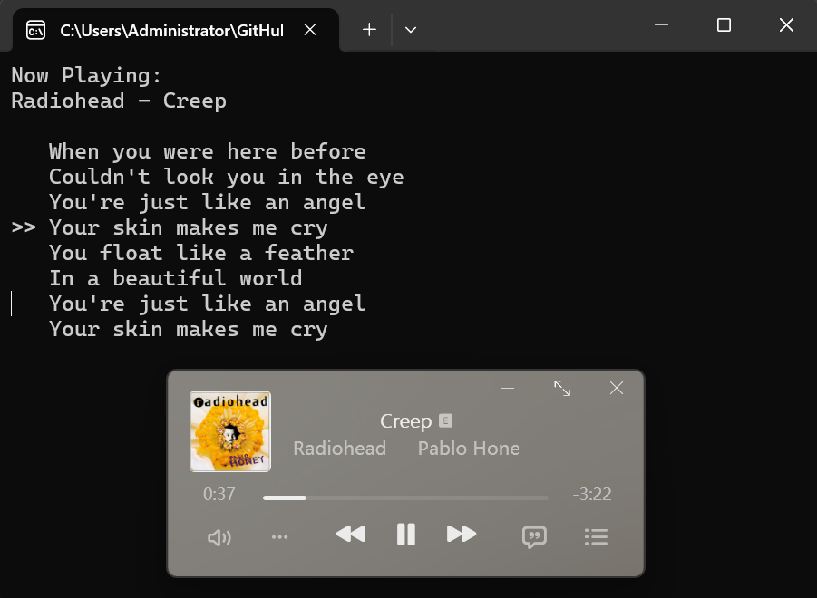
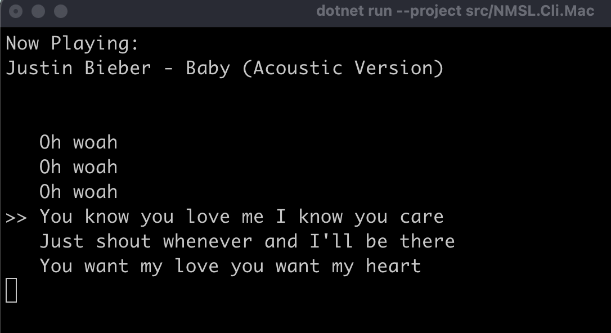

<p align="center">
  
</p>

# OmniLyrics

[English](./README.md) | 简体中文

OmniLyrics：一次个人尝试，打造一直想要的歌词工具——提供 CLI、TUI、GUI，并支持跨平台。

已支持五种 GUI 布局、双语逐字歌词、共享偏好与队列缓存。
**0.4.1（开发中）** 新增单文件构建、macOS 原生播放接入、更多播放器的收藏功能与安全局域网配对。
配置与集成方式见 [使用指南](./docs/user-guide.zh-CN.md)。

## 效果展示

当前 GUI（专注布局）：


早期 Windows GUI（上方：Cider 迷你播放器，下方：OmniLyrics）：


Windows 终端（默认模式）：



macOS 终端（默认模式）：



Linux Waybar（单行模式，--mode line）：


## 编译运行

从源码编译需要下载并安装 [.NET 10 LTS SDK](https://dotnet.microsoft.com/en-us/download/dotnet/10.0)。
0.4.1 的便携构建将 CLI 和 GUI 分别打包为独立的单个可执行文件，内含 .NET 运行时，运行时无需另行安装 .NET。

> macOS 上 Apple Music 和 Spotify 通过系统自带的 Apple Events 桥接连接，首次使用时请允许「自动化」权限，无需安装 Homebrew 依赖。Cider 使用已有 Web API。
>
>「设置 → macOS 环境」提供连接检测和 Homebrew 安装按钮。原生接入与兜底都不可用时，每次启动都会再次提示安装。

> 其他播放器可选安装 `media-control` 作为兜底：
> ```bash
> brew install media-control
> ```

macOS GUI 构建会在便携单文件之外提供 `OmniLyrics.app.zip`，便于通过 Finder 启动；菜单、Dock 与“关于”均显示 OmniLyrics。应用包使用临时签名，尚无 Developer ID 公证。可为本地发布结果打包：

```bash
bash build/macos/package.sh /path/to/OmniLyrics.Gui /path/to/package-output 0.4.1
```

收藏支持 Apple Music（macOS 原生）、Spotify（可配置的浏览器授权）、YesPlayMusic（扫码授权）和 Cider，详见[账号配置](./docs/user-guide.zh-CN.md#收藏与账号授权)。托盘快捷菜单可恢复 100% 缩放并找回设置窗口。

克隆仓库：

```bash
git clone https://github.com/zzxzzk115/OmniLyrics.git
```

编译并运行：

```bash
cd OmniLyrics

# 编译整个解决方案
dotnet build

# 启动 GUI
dotnet run --project src/OmniLyrics.Gui

# 启动 CLI
dotnet run --project src/OmniLyrics.Cli

# 以单行输出模式启动 CLI
# （适用于状态栏）
dotnet run --project src/OmniLyrics.Cli -- --mode line

# 为桌面组件输出 JSON 数据，包含双语歌词
dotnet run --project src/OmniLyrics.Cli -- --mode json

# -------------------------------------------------------------------
# 远程控制命令
# 请保持来源设备上的 OmniLyrics 实例运行。
# 若已选择配对设备作为来源，需要该设备授予播放控制权限。
# -------------------------------------------------------------------

# 播放控制
dotnet run --project src/OmniLyrics.Cli -- --control play
dotnet run --project src/OmniLyrics.Cli -- --control pause
dotnet run --project src/OmniLyrics.Cli -- --control toggle

# 切换歌曲
dotnet run --project src/OmniLyrics.Cli -- --control prev
dotnet run --project src/OmniLyrics.Cli -- --control next

# 跳转到指定位置（单位：秒）
dotnet run --project src/OmniLyrics.Cli -- --control seek 10
```

### Waybar 模块配置

```json
// OmniLyrics
"custom/OmniLyrics": {
  "format": "  {text}",
  "exec": "/path/to/OmniLyrics.Cli --mode line",
  "return-type": "text",
  "escape": true
},
```

---

## 显示局域网设备的歌词

可以显示另一台电脑的歌词，包括来源提供的逐字时间与译文。请保持两台设备上的 OmniLyrics 运行：

1. 在来源设备打开 **设置 → 局域网设备**，启用共享并保存，然后使用其局域网地址生成邀请。
2. 在接收设备点击 **发现附近设备** 查找可用来源，再将来源设备的私密邀请粘贴到 **配对设备** 中。发现被阻止时，仍可直接通过邀请连接。
3. 选择已配对设备，点击 **显示此设备的歌词**。点击 **使用本机播放器** 可以切回。

共享默认关闭。邀请五分钟有效，仅可使用一次，请私下传递。配对默认只有歌词读取权限；生成邀请时勾选 **同时允许控制播放和收藏** 才会授予这些权限。可以随时在来源设备撤销授权。

同一台电脑上的 OmniLyrics 通过回环 HTTP/UDP 通信，无需配对或令牌。其他设备使用经过认证和证书验证的 HTTPS。局域网默认使用 TCP `27271` 提供 HTTPS、UDP `32652` 发现设备。CLI 与交互式终端通过 `OmniLyrics.Cli config lan` 配置。

命令、防火墙设置和设备管理见 [共享服务与局域网配置](./docs/user-guide.zh-CN.md#共享服务与局域网)。本机桌面组件接入见 [Quickshell 集成指南](./integrations/quickshell/README.md)。

## Web API 接口

GUI、TUI 和 CLI（含 JSON 模式）共享本机 HTTP 服务 `http://127.0.0.1:27270`，无需认证。服务所有者退出后，其余本机实例按 GUI → TUI → CLI 的顺序接管。
以下接口也通过 HTTPS 提供给已配对的局域网客户端；播放控制和收藏需要控制权限。快照、收藏与请求详情见 [协议指南](./docs/user-guide.zh-CN.md#web-api)。

### 歌词 API

#### **GET /snapshot**

同时返回播放器状态与对应歌词，包含逐字时间、译文、加载状态和歌词版本标识。推荐显示同步歌词的客户端使用。

#### **GET /lyrics**

以 JSON 格式返回当前歌曲解析后的 LRC 歌词。

**响应**

```json
[
  { "timestamp": "00:00:12.4500000", "text": "We're no strangers to love" },
  { "timestamp": "00:00:16.8000000", "text": "You know the rules and so do I" }
]
```

已有歌曲，但歌词尚未加载时：

```json
null
```

没有当前播放器状态时返回 `404 Not Found`。

---

### 播放控制 API

所有控制接口在成功时返回 `200 OK`。

#### **POST /playback/play**

开始播放。

#### **POST /playback/pause**

暂停播放。

#### **POST /playback/toggle**

切换播放／暂停状态。

#### **POST /playback/next**

切换到下一首。

#### **POST /playback/prev**

切换到上一首。

#### **POST /playback/seek**

跳转到指定位置。

**请求体：**

```json
{ "position": 42.5 }
```

（单位：秒）

---

### 元数据 API

#### **GET /playback/state**

以 JSON 格式返回当前播放器状态：

```json
{
  "title": "Song Title",
  "artists": ["Artist A", "Artist B"],
  "album": "Best Album",
  "position": "00:00:12.3400000",
  "duration": "00:03:00",
  "playing": true,
  "sourceApp": "Cider",
  "artworkUrl": "https://example.com/art.jpg",
  "artworkWidth": 640,
  "artworkHeight": 640
}
```

---

## Cider V3+ 设置

Cider V4 是当前商用版本，V3 仍为兼容目标。不支持 V2 和 V1。

- **启用认证：** 在 Cider 的 Settings → Connectivity → Manage External Application Access 中创建应用令牌，然后在 OmniLyrics 的「设置 → 播放器连接」中填写，或在 CLI 中运行 `config cider token`。
- **关闭认证：** 在 Cider 中关闭 **Require API Tokens**，然后在 OmniLyrics 中选择「无令牌」，或运行 `config cider none`。此模式下 API 无需令牌即可使用，包括播放器支持的收藏功能。

GUI、交互终端和 CLI 共享这些设置。令牌输入框留空会保留已保存的令牌。参见 [连接详情](./docs/user-guide.zh-CN.md#cider-v3-连接与认证)。

## 待办清单

通用后端：

- [x] Windows SMTC
- [x] Linux MPRIS
- [x] macOS 可选 media-control 兜底
- [x] macOS Apple Music / Spotify 原生 Apple Events 接入

播放器专用后端：

- [x] [Cider V3+](https://cider.sh/)（V4 已测试，V3 为兼容目标）
- [x] [YesPlayMusic](https://github.com/qier222/YesPlayMusic)

服务与 API

- [x] 本机 UDP 控制（127.0.0.1:32651）
- [x] 本机 Web API（http://127.0.0.1:27270）
- [x] 局域网发现、经过认证的 HTTPS 配对与设备授权撤销

CLI：

- [x] 多行模式（默认）
- [x] 单行模式（适用于 Waybar）
- [x] 本机 UDP 控制与已授权配对设备的 HTTPS 控制

TUI：

- [x] 交互式共享配置，包含局域网配对

GUI：

- [x] 五种布局、双语逐字歌词、窗口锁定和可选收藏功能
- [x] 支持搜索的设置、外观调整和中英界面
- [x] 选择已配对局域网设备作为歌词来源

## 致谢

- [Lyricify-Lyrics-Helper](https://github.com/WXRIW/Lyricify-Lyrics-Helper)
- [WindowsMediaController](https://github.com/DubyaDude/WindowsMediaController)
- [Tmds.DBus](https://github.com/tmds/Tmds.DBus)
- [media-control](https://github.com/ungive/media-control)

## 许可

本项目采用 [MIT 许可证](./LICENSE)。
