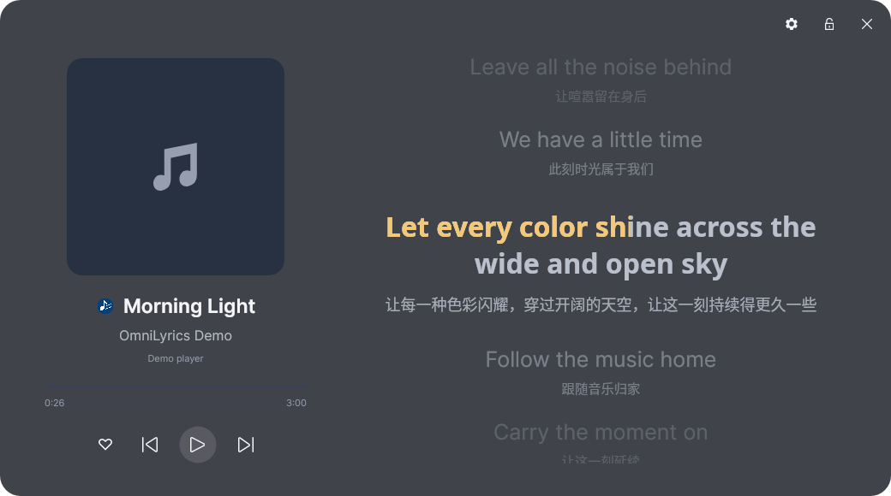

# OmniLyrics

[English](./README.md) | 简体中文

OmniLyrics：尝试做一款自己想用的跨平台歌词工具，提供 CLI、交互终端、GUI 和桌面组件集成。作者：**Lazy_V**。

开发版本 **0.4.0**。支持五种 GUI 布局、逐字与双语歌词、共享偏好、队列预缓存，以及播放器支持时的收藏操作。
详细配置、其他预设截图与集成方式见 [使用指南](./docs/user-guide.zh-CN.md)。

## 效果展示

专注预设：



## 编译运行

安装 [.NET 10 LTS SDK](https://dotnet.microsoft.com/en-us/download/dotnet/10.0)。macOS 还需安装 `media-control`：

```bash
brew install media-control
```

```bash
git clone https://github.com/zzxzzk115/OmniLyrics.git
cd OmniLyrics
dotnet build
dotnet run --project src/OmniLyrics.Gui
dotnet run --project src/OmniLyrics.Cli
# 状态栏单行输出
dotnet run --project src/OmniLyrics.Cli -- --mode line
# 交互配置
dotnet run --project src/OmniLyrics.Cli -- config
```

## 播放器与设置

Windows 使用 SMTC，macOS 使用 `media-control`，Linux 使用 MPRIS；也提供 Cider V3+ Web API 和 YesPlayMusic 接入。
本轮实机验证为 Linux 与 Cider V4，其他平台仍需验收。播放、队列和收藏是独立能力。

Cider V4 是当前商用版本，V3 为兼容目标；V2、V1 不在支持范围。

- **使用 token：** 在 Cider 的 Settings → Connectivity → Manage External Application Access 创建应用令牌，再在 OmniLyrics 的“设置 → 播放器连接”填写，或执行 `config cider token`。
- **不使用 token：** 在 Cider 主动关闭 **Require API Tokens**，然后在 OmniLyrics 选择无令牌模式，或执行 `config cider none`。此时 API 和支持的收藏操作都不需要 token。

GUI、交互终端和 CLI 共享配置。令牌框留空保留旧令牌，截图不包含真实令牌。

设置支持中英切换、左侧导航与搜索、字号颜色、透明度、毛玻璃和锁定。高级菜单可编辑配置文件，外部有效修改会自动同步。
关于页显示项目版本、作者与 GitHub 仓库。五种预设和外观说明见 [界面指南](./docs/user-guide.zh-CN.md#五种界面预设)。

## 接口与集成

默认及单行模式提供 HTTP（27270）与 UDP（32651）服务，GUI 可复用已有 CLI；JSON 组件模式不监听服务端口。

- [Web API 与局域网配置](./docs/user-guide.md#web-api-endpoints)
- [Quickshell 集成](./integrations/quickshell/README.md)
- [歌词来源与 Lyricify 调研](./docs/lyricify-research.md)

## 致谢与许可

感谢 [Lyricify Lyrics Helper](https://github.com/WXRIW/Lyricify-Lyrics-Helper)、
[WindowsMediaController](https://github.com/DubyaDude/WindowsMediaController)、
[Tmds.DBus](https://github.com/tmds/Tmds.DBus) 与 [media-control](https://github.com/ungive/media-control)。
本项目采用 [MIT 许可证](./LICENSE)。
