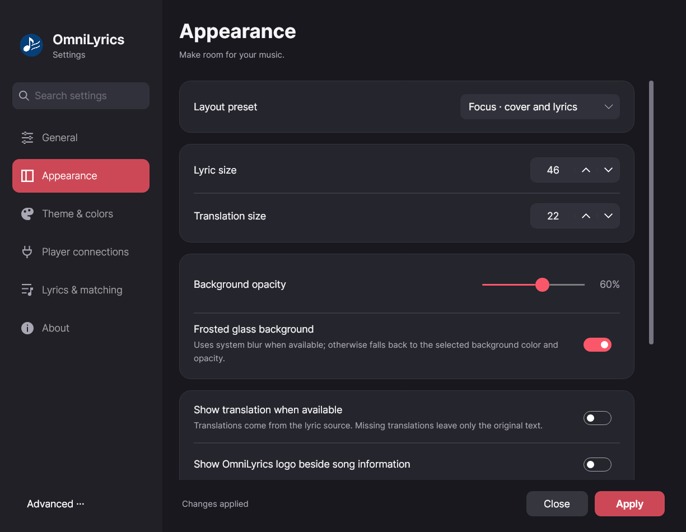
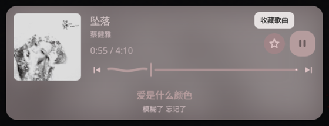
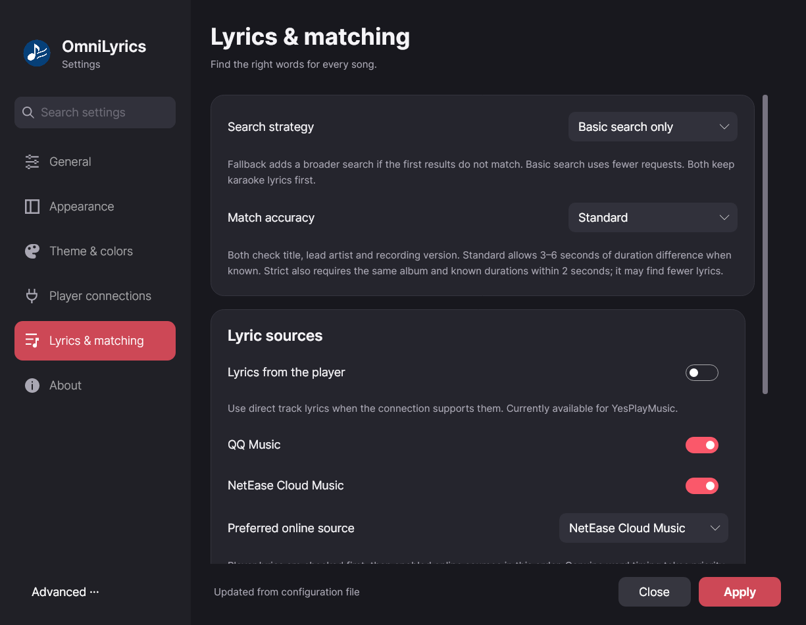

# OmniLyrics

English | [简体中文](../README.zh-CN.md)

OmniLyrics is a cross-platform lyric companion for Windows, macOS and Linux,
with GUI, command-line output and desktop-widget integrations. Lyric retrieval,
karaoke priority, caching and language preferences are shared across players.

See the [implementation and acceptance notes (简体中文)](./acceptance-2026-09-25.md) for this update's validation and remaining limitations.

## Players and platforms

| Platform | Playback connection | Examples |
| --- | --- | --- |
| Windows | System Media Transport Controls (SMTC) | Spotify and other applications exposing system media controls |
| macOS | `media-control` | Apple Music, Spotify, Cider and other applications exposing Now Playing |
| Linux | MPRIS | Spotify and other MPRIS players |
| All three | Optional player-specific connections | Cider V3+ Web API; YesPlayMusic integration |

Playback detection and access to an upcoming queue are separate capabilities.
The current queue adapters support Cider's Web API and the optional MPRIS
`TrackList` interface. A player without a supported queue adapter still uses
karaoke-first fetching and cached lyrics for the current track. Spotify's Web API
queue and Apple Music's native macOS queue are not integrated yet. This update
was runtime-tested on Linux; macOS and Windows combinations still need testing
on those platforms.

## Shared preferences

Open **Settings** from the lyric window's gear button or the tray. General lyric
and language preferences come first; player-specific connection options are
separate. Choose **Follow system**, **简体中文**, or **English**. GUI language
changes apply immediately. CLI output uses the same saved language.

**Karaoke has highest priority for every player.** The fetcher looks for genuine
word timing across available sources before using line-synced lyrics. A match
from one source containing only LRC does not stop the search for QRC/YRC elsewhere.
The same policy applies to the GUI, CLI and JSON widget output.

When an upcoming queue is available, OmniLyrics prefetches the next **5** tracks
by default after the current track has loaded. One background song is fetched at
a time; foreground requests for a different song can proceed immediately, and
requests for the same song share their in-flight result within a process. The
queue is rechecked on track changes and about every 15 seconds. Already-started
requests can finish into the cache after a queue change; obsolete pending entries
are skipped. The Cider adapter skips history/current tracks and ignores ambiguous
queues where the current track ID occurs more than once.

Successful word-timed lyrics are cached for 7 days, an LRC fallback for 10 minutes,
and failed requests for 1 minute. The bounded memory/disk cache holds up to 256
entries; disk files live in `cache/lyrics` under the shared configuration directory.
Frontends attached to the same service share its lyric manager, cache and in-flight requests.
Independent services can reuse completed disk entries but do not merge in-flight requests. Prefetch cannot create word timing where providers offer none.

```bash
# Interactive preferences (lyrics/caching or a player connection)
dotnet run --project src/OmniLyrics.Cli -- config
# Shared language and queue preferences
dotnet run --project src/OmniLyrics.Cli -- config language zh-CN
# Also accepts en or auto
dotnet run --project src/OmniLyrics.Cli -- config lyrics prefetch on
dotnet run --project src/OmniLyrics.Cli -- config lyrics count 5
dotnet run --project src/OmniLyrics.Cli -- config show
# Open the GUI preferences directly
dotnet run --project src/OmniLyrics.Gui -- --settings
```

| Platform | Configuration directory |
| --- | --- |
| Windows | `%APPDATA%\OmniLyrics` |
| macOS | `~/Library/Application Support/OmniLyrics` |
| Linux | `~/.config/omnilyrics` |

`OMNILYRICS_CONFIG_DIR` selects another shared directory. `OMNILYRICS_LANGUAGE`
can override the saved language for one process. The Linux default remains
consistent when a bundled desktop shell overrides `XDG_CONFIG_HOME`.

```json
{
  "version": 1,
  "language": "auto",
  "lyrics": { "prefetch": true, "prefetchCount": 5 }
}
```

No player-specific credentials are required to save these preferences. Cider API
credentials, when needed, are kept in a separate `cider-token` file with private
permissions on Linux/macOS. They never appear in `config.json` or `config show`.
The Cider settings section accepts a token or no-token mode; a blank password
field preserves a saved token. See [Cider configuration](#cider-v3-support-and-configuration).

## GUI layouts and appearance

Settings use left-side navigation and English/Chinese search, with separate
General, Appearance, Theme & colors, Player connections and About pages. About identifies the
author **Lazy_V** and links to this repository.

| Preset | Layout |
| --- | --- |
| Classic | Floating current/next original lines, with an optional translation beneath the current line |
| Compact | Small current-line window, with an optional translation |
| Focus | Album artwork and song information beside five lines of lyric context |
| Portrait | Compact song header above wrapped, vertically arranged lyrics |
| Fullscreen | Centered lyric context and a separate song-information area; Esc returns to Focus |

Appearance controls include lyric and translation sizes, text/highlight/background
colors, background opacity, optional frosted glass, translation visibility,
OmniLyrics logo and player information. Blur depends on the operating system and
compositor; unsupported systems use the chosen background color and opacity.
Use the fixed Apply button to update the open lyric window; saved choices survive restart.
Reading layouts adapt when resized, with playback and favorites beside the song
information. The upper-right toolbar contains Settings, Lock and Close.

Theme & colors offers **Dark + Red, Dark + Blue, Light + Blue and Light + Red**.
Customize the interface mode, accent, lyric text, highlight and canvas colors.
Color presets are independent of layout, font sizes, opacity and blur. Name a
palette to save it, select it again, update it by saving the same name, or delete
it. Saving a preset does not activate it; use Apply. Up to 32 custom palettes are
stored in `config.json` under `themePresets` (names: 1–64 characters).

Advanced → Edit configuration opens the shared JSON editor. Valid file changes
also sync automatically from external editors. Invalid edits keep the last valid
settings; an editor with unsaved changes does not overwrite an external update.
The ordinary settings page does not display the configuration path. About reads
the **0.4.0** development version from build metadata.


Locking prevents dragging the window. Resizing, playback, favorites and settings
remain available. Unlock with the lock button, tray, Settings, or **Ctrl+L** while the lyric window has focus. This is a position lock;
it does not currently provide mouse click-through on every platform. Closing the
lyric window hides it to the tray; use Quit in the tray to exit.

The favorite icon is shown only when the current connection reports a usable
library capability. It reflects confirmed state; background reads never trigger
a busy animation. The concrete adapter currently supports Cider V4's library
API, with or without a token according to Cider's authentication setting. Other
system media protocols do not automatically supply favorites. When the GUI
attaches to a CLI, favorite reads and writes go through that CLI.

## Lyrics and translation

Correct recording selection comes before timing quality. Matching checks title,
lead artist, version markers and duration before accepting a candidate. These
checks reduce obvious wrong-song, live-version and edited-recording matches;
they do not guarantee audio-level alignment or replace manual correction tools.

Genuine QRC/YRC syllable timing is used first. QQ, NetEase and YesPlayMusic
translations are retained when available; translations are aligned by timestamps,
not by line number. Missing or ambiguous translations leave the original alone.
The stored model and HTTP snapshots preserve translation and line-end fields.
JSON widget output also includes `currentTranslation` and `nextTranslation`.

For ordinary LRC, **Simulate highlighting** is enabled by default and estimates
a sweep between line boundaries. Disable it for whole-line highlighting.
The setting explains that this does not create real word timing,
change cached source tokens, or reproduce the singer's exact rhythm.

See the [Lyricify integration review](./lyricify-research.md) for source
coverage, research evidence and remaining differences from Lyricify.

## Showcase

Current layouts, rendered with original demonstration lyrics and their translation:


Current settings (saved credentials are never displayed):



Earlier platform screenshots:

Windows GUI (Top: Cider Mini Player, Bottom: OmniLyrics):


Windows Terminal (Default Mode):


macOS Terminal (Default Mode):


Linux Waybar (Line Mode, --mode line):


## Build Instruction
Download and Install [.NET SDK 10.0 (LTS)](https://dotnet.microsoft.com/en-us/download/dotnet/10.0)

> On macOS, you need to install `media-control`:
> ```bash
> brew install media-control
> ```

Clone:

```bash
git clone --branch dev https://github.com/zzxzzk115/OmniLyrics.git
```

Build and Run:

```bash
cd OmniLyrics

# Build the entire solution
dotnet build

# Launch the GUI
dotnet run --project src/OmniLyrics.Gui

# Launch the CLI
dotnet run --project src/OmniLyrics.Cli

# Launch the CLI in single-line output mode
# (Suitable for status bars)
dotnet run --project src/OmniLyrics.Cli -- --mode line

# Stream current/next lyric lines as newline-delimited JSON for desktop widgets.
# Reuses a service, or owns it if elected when none is available.
dotnet run --project src/OmniLyrics.Cli -- --mode json

# -------------------------------------------------------------------
# Remote control commands
# These commands require an Omnilyrics instance running in lyrics/daemon mode.
# -------------------------------------------------------------------

# Playback control
dotnet run --project src/OmniLyrics.Cli -- --control play
dotnet run --project src/OmniLyrics.Cli -- --control pause
dotnet run --project src/OmniLyrics.Cli -- --control toggle

# Track navigation
dotnet run --project src/OmniLyrics.Cli -- --control prev
dotnet run --project src/OmniLyrics.Cli -- --control next

# Seek to a position (in seconds)
dotnet run --project src/OmniLyrics.Cli -- --control seek 10
```

The SDK is selected by `global.json`. Restore audits direct and transitive NuGet
dependencies and fails on known vulnerability advisories.

### Linux runtime checks

After `dotnet build -c Release`, run `python3 tests/linux_smoke.py` from the repository root.
The checks require a graphical desktop, Python 3 with PyGObject, `dbus-run-session`,
`iproute2`, `util-linux`, and enabled unprivileged user/network namespaces.
They run CLI and GUI instances with an isolated D-Bus session and network, using a mock
MPRIS player, then close the test instances. No real player is controlled and no external
lyrics service is queried. On Hyprland, window mapping and graceful close are also checked.
Application logs are written to `/tmp/omnilyrics-cli-smoke.log` and
`/tmp/omnilyrics-gui-smoke.log`.

Cider authentication and favorites also have local mock checks that do not modify
your real music library:

```bash
dotnet run --project tests/CiderApiSmoke -c Release
python3 -m unittest discover -s tests -p 'test_*.py' -v
# Linux desktop: timing, parsing and actual Avalonia rendering checks
dotnet run --project tests/KaraokeSmoke -c Release
# Generic sources and queues: priority, cache reuse, retries and prefetch
dotnet run --project tests/PrefetchSmoke -c Release
# Favorite capability and confirmed writes against a mock server
dotnet run --project tests/FavoritesSmoke -c Release
# Layouts, translation, lock, settings and favorite UI (mock player)
dotnet run --project tests/UiSmoke -c Release
# Real HTTP protocol with simulated players: GUI attachment and failover
dotnet run --project tests/ServiceSmoke -c Release
```

### Waybar Module Config

```json
// OmniLyrics
"custom/OmniLyrics": {
  "format": "  {text}",
  "exec": "/path/to/OmniLyrics.Cli --mode line",
  "return-type": "text",
  "escape": true
},
```

### Shared service across GUI, TUI and CLI

All lyric frontends look for the compatible service at `controlHost` and `httpPort`
(default `127.0.0.1:27270`). Followers share player state, timed lyrics and controls
without opening a second player connection. The lyric header displays the player name.

If there is no service, local frontends elect one owner in GUI → TUI → CLI order.
A healthy service keeps ownership even if a higher-priority frontend opens later.
On exit or crash, remaining frontends compete again. JSON widget mode participates
as CLI. Foreign or incompatible listeners are never controlled; candidates wait
until both HTTP and UDP ports are available. See the endpoint section below for LAN behavior.

The GUI uses `GET /snapshot`, which returns `service`, `protocolVersion`, `state`,
`lyrics`, `loading` and `lyricsVersion`. State and lyrics belong to the same track;
lyrics include QRC/YRC token start times and durations when available. The CLI
shares its karaoke-first lyric manager and queue cache with all connected GUIs. Existing
`/lyrics` and `/playback/*` endpoints remain available. For a remote CLI on a
trusted LAN, set `config server target HOST` and the matching HTTP port.

### Quickshell music widget

The end4/illogical-impulse integration displays the current lyric in the bar and
current/next lyrics in a wider music panel. With Cider V4, the panel also shows a
star button to favorite or unfavorite the current song, reflecting its actual
Apple Music rating. See [installation and token configuration](../integrations/quickshell/README.md).



---

## Lyric search preferences

**Settings → Lyrics & matching** controls the actual shared search pipeline:

- Search with fallback (default) broadens the search after unsuitable first results; basic search uses fewer requests. Both prefer genuine karaoke timing.
- Standard matching checks title, lead artist, recording version and known durations. Strict also requires the same album and known durations within two seconds, which may reduce matches.
- Enable player lyrics (currently YesPlayMusic), QQ Music and NetEase individually, with a preferred online source. Player lyrics are checked first; line lyrics never outrank another enabled source's word timings.
- Changes reload the current song using a cache partition for the selected policy. Prefetch-only changes preserve existing cache entries.

GUI, interactive `config` and CLI share these preferences; running local services reload them automatically:

```bash
OmniLyrics.Cli config lyrics strategy fallback  # or quick
OmniLyrics.Cli config lyrics match balanced     # or strict
OmniLyrics.Cli config lyrics sources player,qq,netease
OmniLyrics.Cli config lyrics prefer netease     # or qq
```



## Web API Endpoints

All lyric frontends attach to an existing OmniLyrics service first. If none is available,
local candidates elect one owner in **GUI → TUI (default terminal view) → CLI (line/JSON)** order.
That owner starts HTTP (default `http://127.0.0.1:27270`) and UDP (port `32651`) together.
This allows external apps, widgets, or scripts to fetch lyrics or control playback.

### Local and LAN access

The default listen address is `127.0.0.1`. To allow other devices on a trusted
LAN, choose `0.0.0.0` (all IPv4 interfaces) or a specific address of this computer:

```bash
# Save the listening mode, then start/restart the lyrics instance.
dotnet run --project src/OmniLyrics.Cli -- config server lan
dotnet run --project src/OmniLyrics.Cli -- --mode line

# Or override it for one run, with optional custom ports.
dotnet run --project src/OmniLyrics.Cli -- --mode line --listen 0.0.0.0 --http-port 27270 --udp-port 32651

# On another device: use the server's actual LAN address, not 0.0.0.0.
dotnet run --project src/OmniLyrics.Cli -- --host 192.168.1.50 --udp-port 32651 --control pause
curl http://192.168.1.50:27270/lyrics

# Return to local-only listening after restarting the lyrics instance.
dotnet run --project src/OmniLyrics.Cli -- config server local
```

Other saved options are `config server listen ADDRESS`, `config server target HOST`
and `config server ports HTTP_PORT UDP_PORT`. They are stored under `server` as
`listenAddress`, `controlHost`, `httpPort` and `udpPort`. Environment overrides are
`OMNILYRICS_LISTEN_ADDRESS`, `OMNILYRICS_CONTROL_HOST`, `OMNILYRICS_HTTP_PORT` and
`OMNILYRICS_UDP_PORT`; command-line options take precedence. Listen/port changes
require restarting a CLI with command-line overrides. The GUI observes saved endpoint changes.
JSON widget mode also joins the election. Healthy owners are not preempted; on exit or crash,
remaining instances take over. An OS-held exclusive lease and binding both ports before player
startup prevent duplicate owners. Foreign listeners are left alone while candidates retry.
Election is local to one computer, configuration directory and port pair; a configured
remote host is only followed, never replaced by a local service when it is offline.

These OmniLyrics HTTP/UDP endpoints currently have no authentication. Use LAN
listening only on trusted networks and allow the selected ports through your
firewall when needed. The Cider token authenticates requests to Cider; it does
not protect OmniLyrics' own control endpoints. Cider's local API address and
OmniLyrics' server listening address are separate settings.

### Lyrics API

#### **GET /lyrics**

Returns the current track's parsed lyrics as JSON, including word timing when available.

**Response**

```json
[
  { "timestamp": "00:00:12.4500000", "text": "We're no strangers to love" },
  { "timestamp": "00:00:16.8000000", "text": "You know the rules and so do I" }
]
```

If no lyrics are available:

```json
null
```

---

### Playback Control API

All control endpoints return `200 OK` on success.

#### **POST /playback/play**

Starts playback.

#### **POST /playback/pause**

Pauses playback.

#### **POST /playback/toggle**

Toggles play/pause.

#### **POST /playback/next**

Skips to the next track.

#### **POST /playback/prev**

Skips to the previous track.

#### **POST /playback/seek**

Seek to a given position.

**Body:**

```json
{ "position": 42.5 }
```

(seconds)

---

### Optional favorites API

`GET /favorites` returns `{ "trackId": "…", "mediaKey": "…", "isFavorite": false }`
for the current track, or 404 when the connection cannot supply it.
`POST /favorites` takes `{ "previous": <the GET response>, "favorite": true }`.
A stale track or unconfirmed write returns 409; an unsupported backend returns 404.
Only confirmed state is returned as success. Credentials remain inside the service owner.

The Cider endpoint acts on now-playing, so its adapter checks the track immediately
before writing and during confirmation. It cannot provide a server-side atomic
track-ID write, and it never automatically retries a failed mutation.

### Metadata API

#### **GET /playback/state**

Returns the current player state as JSON:

```json
{
  "title": "Song Title",
  "artists": ["Artist A", "Artist B"],
  "album": "Best Album",
  "position": "00:00:12.3400000",
  "duration": "00:03:00",
  "playing": true,
  "sourceApp": "Cider",
  "artworkUrl": "https://example.com/art.jpg",
  "artworkWidth": 640,
  "artworkHeight": 640
}
```

---

## Cider V3+ support and configuration

Cider V4 is the current commercial version; V3 is the older supported version.
The playback backend uses the compatible local `/api/v1/playback` interface on
port `10767`. Cider V2 and V1 are outside the supported integration target.
The GUI and Quickshell favorite adapters use V4's `/api/v2` library interface; it has been
verified with V4, not V3.

### Playback integration

| Setting | Behavior |
| --- | --- |
| `auto` (default) | Prefer a working Cider Web API; use MPRIS when the API is unavailable. |
| `webapi` | Use only the Web API for Cider. Recommended for V3, whose MPRIS implementation is incomplete. Other Linux players still use MPRIS. |
| `mpris` | On Linux, prefer Cider MPRIS when it reports playback/navigation/seek capabilities and a track ID; otherwise fall back to Web API. |

Choose the integration in GUI **Settings → Player connections → Cider**, or run:

```bash
dotnet run --project src/OmniLyrics.Cli -- config cider integration webapi
# V4 on Linux:
dotnet run --project src/OmniLyrics.Cli -- config cider integration mpris
```

The local V4 installation advertises these MPRIS capabilities. This is a capability
check, not a claim of complete MPRIS conformance. Do not infer Cider's major version
from `/api/v2/client/info`: its reported version can differ from the application's
displayed version. Favorites always use the Web API, regardless of playback mode.

### With an API token (authentication enabled in Cider)

In Cider, open **Settings → Connectivity → Manage External Application Access to
Cider**, leave **Require API Tokens** enabled, and create a token for OmniLyrics
or Quickshell. Allow `playback` for song information and playback controls, and
`library` for the GUI or Quickshell favorite button. No account-token access is needed.

Configure it with the shared GUI settings page or the terminal prompt:

```bash
dotnet run --project src/OmniLyrics.Cli -- config cider token
# Enter the token at the hidden prompt, then optionally check connectivity.
dotnet run --project src/OmniLyrics.Cli -- config cider test
dotnet run --project src/OmniLyrics.Cli -- --mode json
```

For automation, `config cider token --stdin` reads the token from standard input.
Keep actual token contents out of shell command arguments and screenshots.

### Without an API token (authentication disabled in Cider)

Turn off **Require API Tokens** in Cider, then select **No token** in OmniLyrics
settings or run:

```bash
dotnet run --project src/OmniLyrics.Cli -- config cider none
```

This enables the local API without an `apptoken` header, **including V4 favorites
and unfavorites**. Other local applications can also access that API while its
authentication is disabled. OmniLyrics does not change Cider's authentication
switch for you.

On Linux with V4, MPRIS is also available for song information, lyrics and playback
controls without a token, even while Cider's API authentication remains enabled.
Favorites use Cider's library API and follow its authentication setting.

### Environment overrides and existing setups

`CIDER_AUTH_MODE=token` or `none` overrides the saved authentication mode.
In token mode, credentials are resolved in this order: `CIDER_API_TOKEN`,
`CIDER_TOKEN_FILE`, then the private `cider-token` file in the configuration
directory. In none mode, all these token sources are ignored. GUI settings and
`config show` indicate when environment overrides are present.

If no authentication mode has been saved, an existing token file or token
environment variable selects token mode; otherwise the default is none. This
keeps older environment-based setups working. Environment changes require
relaunching the affected application; saved settings do not.

V4 is tested locally. V3 uses the existing compatibility backend; it has not been
retested against a running V3 installation in this update.

## TODO List

Common Backends:

- [x] SMTC for Windows
- [x] MPRIS for Linux
- [x] media-control for macOS

Software-specific Backends:
- [x] [Cider V3+](https://cider.sh/) (V4: current commercial version; V3: older supported version)
- [x] [YesPlayMusic](https://github.com/qier222/YesPlayMusic)

Server & API

- [x] UDP Client & Server (localhost:32651)
- [x] Web API (http://localhost:27270)

CLI:

- [x] Multiple Line Mode (Default)
- [x] Single Line Mode (for Waybar)
- [x] Remote Control (through UDP commands)
- [x] JSON lyric stream (for Quickshell and other widgets)

TUI:

GUI:

- [x] Timed QRC/YRC syllable highlighting with LRC fallback
- [x] Next-line preview, pause/seek synchronization and track-change handling
- [x] Five layout presets, lock, logo/player visibility and optional blur
- [x] Original/translated lyric display and optional simulated LRC highlight
- [x] Searchable settings, typography/colors, English and Simplified Chinese
- [x] Optional favorites with confirmed state and CLI protocol support
- [x] Shared Cider integration and token settings
- [x] System tray and close-to-tray behavior

## Acknowledgement

- [Lyricify App](https://github.com/WXRIW/Lyricify-App) — UI reference from its current README
- [Lyricify-Lyrics-Helper](https://github.com/WXRIW/Lyricify-Lyrics-Helper)
- [WindowsMediaController](https://github.com/DubyaDude/WindowsMediaController)
- [Tmds.DBus](https://github.com/tmds/Tmds.DBus)
- [media-control](https://github.com/ungive/media-control)

## License

This project is under the [MIT](../LICENSE) License.
