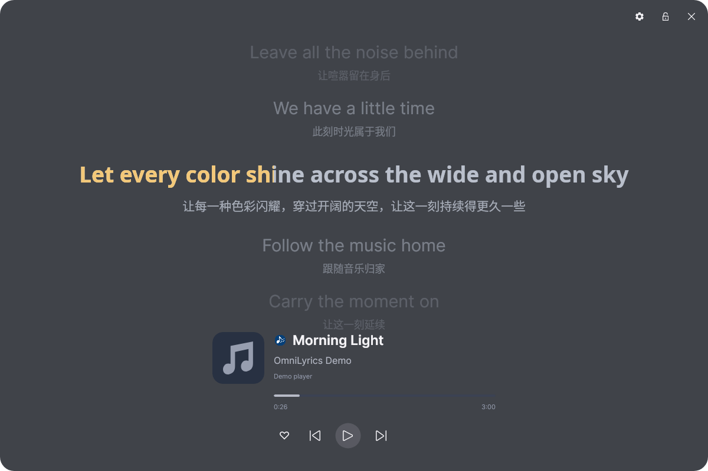
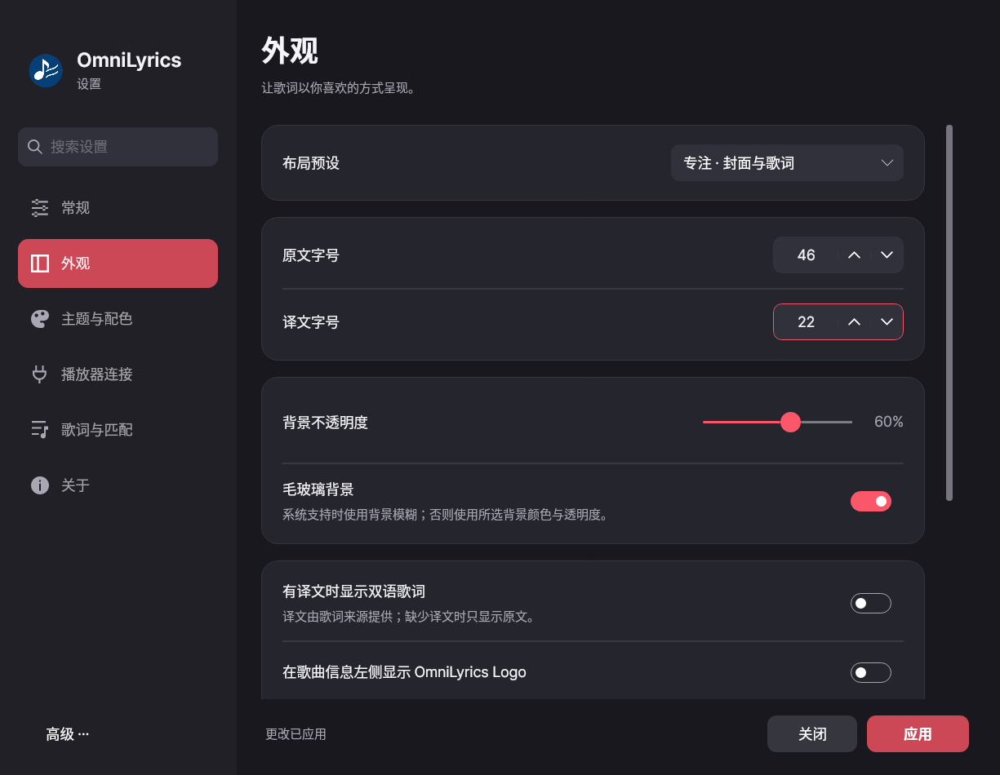
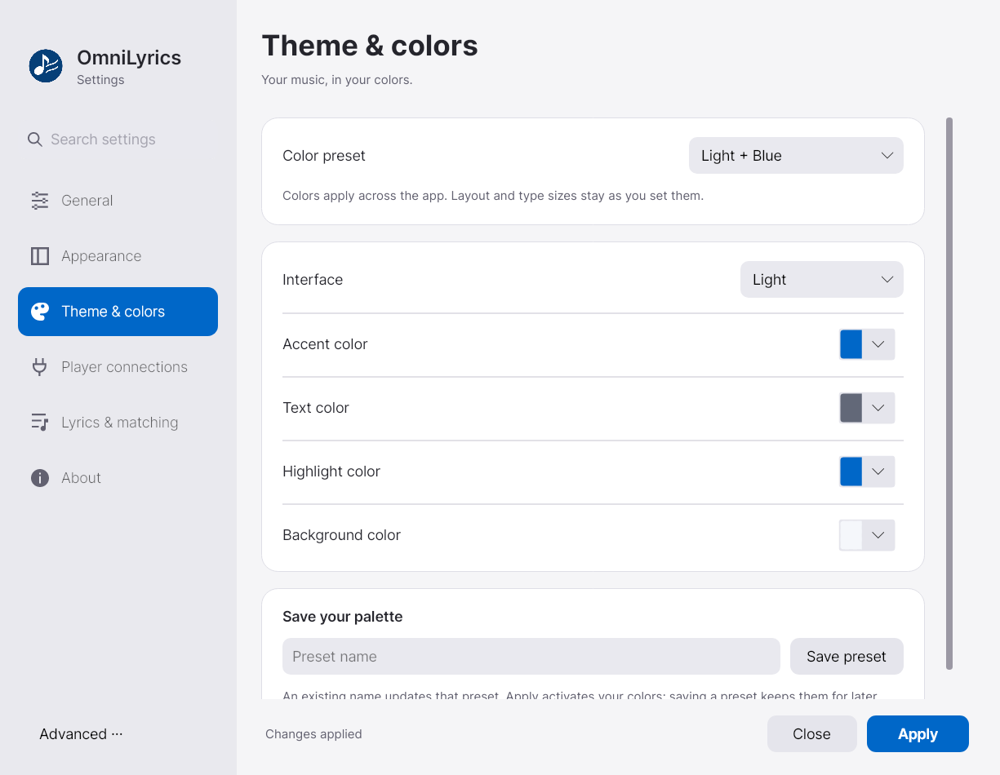
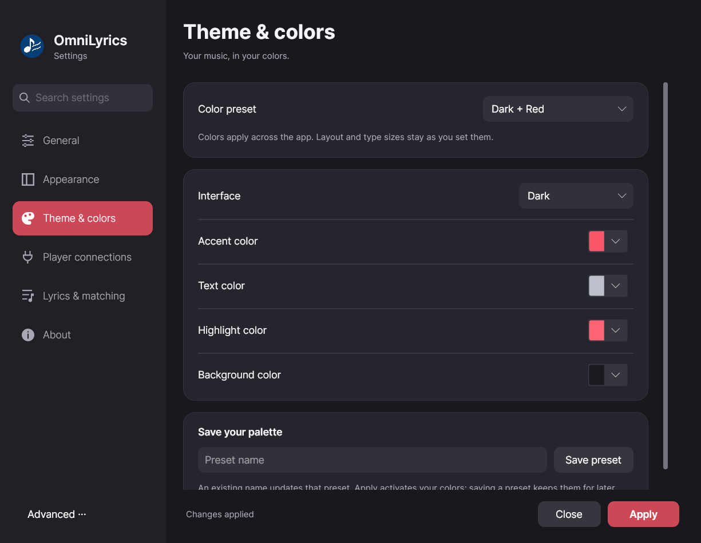
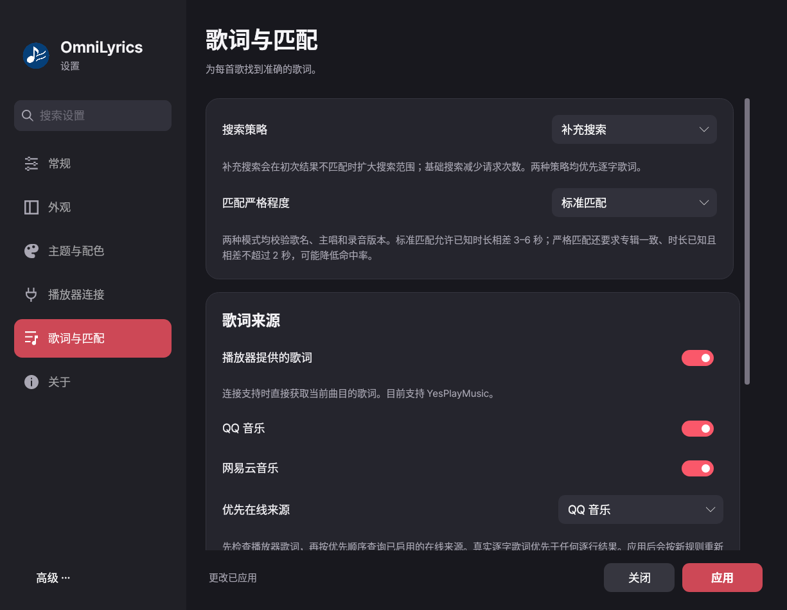

# OmniLyrics

[English](../README.md) | 简体中文

OmniLyrics 是适用于 Windows、macOS 和 Linux 的歌词伴侣，提供 GUI、命令行输出及桌面组件集成。
所有播放器共用逐字歌词优先策略、歌词缓存和语言设置。作者：**Lazy_V**。

本轮功能与验证结果见 [验收说明](./acceptance-2026-09-25.md)。

## 平台与播放器

| 平台 | 播放连接 | 常见组合 |
| --- | --- | --- |
| Windows | 系统媒体控制 SMTC | Spotify 等接入系统媒体会话的播放器 |
| macOS | `media-control` | Apple Music、Spotify、Cider 等提供 Now Playing 信息的播放器 |
| Linux | MPRIS | Spotify 和其他 MPRIS 播放器 |
| 三个平台 | 可选播放器接口 | Cider V3+ Web API、YesPlayMusic |

本轮运行验收在 Linux 上进行；Windows、macOS 仍需实机测试。播放状态、待播队列和收藏是不同能力，不能互相推断。
当前队列适配包括 Cider Web API 和可选的 MPRIS TrackList；尚未接入 Spotify Web API 队列或 macOS Apple Music 原生队列。
没有待播队列时，当前歌曲依然使用相同的歌词搜索和缓存。

## 五种界面预设

| 预设 | 显示方式 |
| --- | --- |
| 经典 | 悬浮双行原文，可在当前行下方显示译文 |
| 紧凑 | 当前歌词与可选译文，占用较少空间 |
| 专注 | 左侧封面与歌曲信息，右侧多行歌词 |
| 竖向 | 顶部歌曲信息，下方可换行的多行歌词 |
| 全屏 | 居中歌词与独立歌曲信息区；按 Esc 返回专注模式 |

以下是实际控件渲染的原创示例歌词：





阅读布局的右上角只保留设置、锁定和关闭，歌曲信息下方提供收藏及播放控制。宽窄窗口会调整排布；经典／紧凑预设保留悬浮播放工具栏。当前连接支持收藏时才显示收藏按钮。
收藏状态以播放器确认结果为准，后台轮询不会触发忙碌动画。当前具体收藏适配为 Cider V4 library API。
GUI 连接已有 CLI 时，收藏请求也经 CLI 转发。MPRIS／SMTC 本身不等于提供收藏能力。

锁定仅禁止拖动窗口位置，缩放、播放、收藏和设置仍可使用。可通过锁按钮、托盘、设置或窗口获得焦点时按 **Ctrl+L** 解锁。
此锁定尚不是跨平台鼠标穿透。关闭歌词窗口会收起到托盘；真正退出请使用托盘的“退出”。

## 设置

设置采用左侧导航与搜索、右侧具体页面的结构，分为常规、外观、主题与配色、播放器连接、歌词与匹配、关于。
关于页包含作者 **Lazy_V**、从构建信息读取的开发版本 **0.4.0** 及 [GitHub 仓库](https://github.com/zzxzzk115/OmniLyrics) 入口。

- 界面语言支持跟随系统、简体中文和 English，切换立即生效。
- 外观支持布局预设、原文／译文字号、背景透明度、毛玻璃开关。
- 「主题与配色」提供 **深色 + 红色、深色 + 蓝色、浅色 + 蓝色、浅色 + 红色**。可自定义深浅界面、主题色、文字色、高亮色与歌词背景色。
- 配色预设与布局、字号、透明度和毛玻璃互不覆盖。自定义预设可命名保存、重新选择、同名更新与删除；保存用于以后选择，底部「应用」才启用配色。
- 自定义配色存储在共享 `config.json` 的 `themePresets` 中，最多 32 个，名称限 1–64 个字符。
- 译文、OmniLyrics Logo、播放器信息、锁定和模拟高亮可独立配置。
- 毛玻璃取决于系统或合成器支持；不可用时回退到所选颜色与透明度。
- 底部「应用」将设置更新到当前窗口，重启后保留。通用偏好不要求先配置 Cider。
- 「高级 → 编辑配置文件」提供 JSON 文本编辑；外部有效修改也会自动同步到设置与歌词窗口。无效编辑保留上次有效值；存在未保存草稿时防止覆盖外部修改。普通设置界面不显示配置路径。





## 逐字、双语与匹配

**先确认歌曲与录音版本正确，再优先寻找真实逐字歌词。** QQ 只有普通 LRC 时，仍会尝试其他来源的逐字歌词。
搜索会检查歌名、主要艺人、Live／Remix 等版本标记和时长，降低同名歌曲、翻唱或不同版本的错配。
元数据校验不能保证音频级对齐，也不能完全替代人工纠正。

QRC／YRC 使用真实词开始时间和持续时长，随播放、暂停、跳转同步。
QQ、网易云与 YesPlayMusic 提供译文时，按时间对应原文，不按行号强行配对；缺少或存在歧义的译文留空。
不使用自动翻译，也不把译文套上原文的逐字时间。

普通 LRC 默认开启“为逐行歌词模拟高亮”，在行时间范围内估算扫过效果；关闭后恢复整行高亮。应用不显示 tooltip，模拟效果的说明保留在设置中。
模拟不生成真实词时间，不改变源歌词和 API 输出。详见 [Lyricify 调研与实现说明](./lyricify-research.md)。

在「歌词与匹配」中可以配置：

- **搜索策略**：补充搜索（默认）在初次结果不合适时扩大搜索；仅基础搜索减少请求。两者均优先真实逐字歌词。
- **匹配严格程度**：标准匹配检查歌名、主唱、录音版本与已知时长；严格匹配还要求专辑一致、双方时长已知且相差不超过 2 秒，可能降低命中率。
- **歌词来源**：分别开关播放器歌词、QQ 音乐、网易云音乐；在线来源可选择 QQ 或网易云优先。播放器直供目前支持 YesPlayMusic。
- **缓存**：是否预取及预取数量。搜索规则变化后，当前歌曲会重新匹配，禁用来源的旧缓存不会继续使用；只修改预取数量不会清空缓存。

CLI、交互终端与 GUI 共用这些设置，运行中的本机服务会自动读取更新。CLI 示例：

```bash
OmniLyrics.Cli config lyrics strategy fallback  # 或 quick
OmniLyrics.Cli config lyrics match balanced     # 或 strict
OmniLyrics.Cli config lyrics sources player,qq,netease
OmniLyrics.Cli config lyrics prefer netease     # 或 qq
```



## 共享服务与接管

GUI、终端多行界面（TUI）以及单行／JSON 输出（CLI，含 Quickshell）会先识别并复用已有 OmniLyrics 服务，共享播放状态、歌词和控制接口。
没有服务时，本机实例按 **GUI → TUI → CLI** 选出唯一服务所有者。同优先级也只启动一个，HTTP 和 UDP 必须同时绑定成功后才连接播放器。
健康服务不会因为打开更高优先级的界面而被打断；退出或崩溃后，剩余实例重新接管。进程持有的独占锁防止重复服务，崩溃后由系统释放。
其他应用占用端口时会等待重试，不会向其发送播放命令。指定远程主机时只连接该主机；离线时等待重连，本机不会冒充远端服务。优先级协调限于同一台电脑、同一份配置和端口。

## 提前缓存

播放器提供待播队列时，默认在当前歌曲加载完成后预取后续 **5 首**。后台一次下载一首；当前歌曲不需要等待另一首后台请求。
同一进程内对同曲的请求合并，所有前端连接同一服务时直接复用服务中的歌词。
队列在切歌和约 15 秒间隔时刷新；Cider 返回的历史／当前歌曲会跳过，无法确定位置的重复歌曲队列会忽略。

真实逐字歌词缓存 7 天，普通歌词回退缓存 10 分钟，失败缓存 1 分钟。内存与磁盘缓存上限为 256 条，磁盘位置为共享配置目录下的 `cache/lyrics`。
同一服务的前端共用在途请求；独立端口或远程服务之间不合并在途请求。提供方没有逐字歌词时，预缓存也不能生成它。

## 编译运行

安装 [.NET 10 LTS SDK](https://dotnet.microsoft.com/en-us/download/dotnet/10.0)。macOS 还需安装 `media-control`：

```bash
brew install media-control
```

```bash
git clone --branch dev https://github.com/zzxzzk115/OmniLyrics.git
cd OmniLyrics
dotnet build -c Release
dotnet run --project src/OmniLyrics.Gui
dotnet run --project src/OmniLyrics.Cli
# 单行输出／JSON 组件输出
dotnet run --project src/OmniLyrics.Cli -- --mode line
dotnet run --project src/OmniLyrics.Cli -- --mode json
# 单独打开设置
dotnet run --project src/OmniLyrics.Gui -- --settings
```

SDK 由 `global.json` 选择。依赖恢复审计直接与间接依赖，已知漏洞告警会使构建失败。

## CLI、交互终端与共享配置

```bash
# 交互式偏好菜单
dotnet run --project src/OmniLyrics.Cli -- config
# 语言：auto、en 或 zh-CN
dotnet run --project src/OmniLyrics.Cli -- config language zh-CN
dotnet run --project src/OmniLyrics.Cli -- config lyrics prefetch on
dotnet run --project src/OmniLyrics.Cli -- config lyrics count 5
dotnet run --project src/OmniLyrics.Cli -- config show
```

| 平台 | 配置目录 |
| --- | --- |
| Windows | `%APPDATA%\OmniLyrics` |
| macOS | `~/Library/Application Support/OmniLyrics` |
| Linux | `~/.config/omnilyrics` |

`OMNILYRICS_CONFIG_DIR` 可指定共享目录，`OMNILYRICS_LANGUAGE` 可覆盖某个进程的语言。
Linux 默认路径不会随桌面 shell 自己的 `XDG_CONFIG_HOME` 覆盖而改变。
外观、语言、歌词与连接配置保存在 `config.json`；令牌单独保存在 `cider-token`，Linux/macOS 文件权限为仅当前用户读写。
GUI 密码框不回填令牌，留空保存即保留旧令牌；`config show` 不输出凭据。

## Cider V3+：令牌与无令牌两种方式

Cider V4 是当前商用版本，V3 为较旧的支持目标，V2／V1 不在支持范围。播放使用兼容的 `/api/v1/playback` 接口；
收藏使用 V4 `/api/v2` library 接口。V4 已在本机验证，V3 未重新做实机验收。

认证开启时，在 Cider 的 **Settings → Connectivity → Manage External Application Access** 创建应用令牌，
授予播放权限；需要收藏时还应授予资料库权限。无需账户令牌。
可在 GUI 的“播放器连接 → Cider”中输入，或通过终端的隐藏输入提示配置：

```bash
dotnet run --project src/OmniLyrics.Cli -- config cider token
dotnet run --project src/OmniLyrics.Cli -- config cider test
# 自动化输入使用标准输入，不把令牌放进命令行参数
# config cider token --stdin
```

**主动关闭 Cider 的 Require API Tokens 后，无需令牌也能使用 API，包括收藏与取消收藏。** 随后在 OmniLyrics 选择无令牌模式：

```bash
dotnet run --project src/OmniLyrics.Cli -- config cider none
```

OmniLyrics 不会替你切换 Cider 的认证开关。Cider 的外部应用令牌不是 Apple Music 的 Media User Token。

| 播放连接选项 | 行为 |
| --- | --- |
| auto | 优先可用的 Cider Web API，再尝试系统连接 |
| webapi | Cider 使用 Web API，适合 MPRIS 支持不完整的 V3 |
| mpris | Linux 上检查 Cider MPRIS 的控制能力后优先使用，不足时回退 Web API |

```bash
dotnet run --project src/OmniLyrics.Cli -- config cider integration webapi
# Linux + V4 可选择 mpris
```

收藏始终依赖 library API 的权限，与播放选择 MPRIS 还是 Web API 分开。
`CIDER_AUTH_MODE` 覆盖认证模式；token 模式依次读取 `CIDER_API_TOKEN`、`CIDER_TOKEN_FILE` 和默认令牌文件。
none 模式忽略全部令牌来源。没有保存模式时，已存在令牌会选 token，否则选 none。

## 共享服务与局域网控制

所有歌词前端先检查已配置地址的兼容服务，复用其播放状态、歌词和控制接口。
没有服务时，按前述 GUI → TUI → CLI 优先级接管；JSON 组件进程也参与。其他程序占用端口不会被当成 OmniLyrics。

默认只监听本机 `127.0.0.1`，HTTP 端口 `27270`，UDP 端口 `32651`。可信局域网可配置：

```bash
dotnet run --project src/OmniLyrics.Cli -- config server lan
# 重启运行中的 CLI 后生效
dotnet run --project src/OmniLyrics.Cli -- --mode line
# 其他设备配置真实目标地址
dotnet run --project src/OmniLyrics.Cli -- config server target 192.168.1.50
# 恢复仅本机监听
dotnet run --project src/OmniLyrics.Cli -- config server local
```

OmniLyrics 的 HTTP／UDP 接口目前没有认证，只适用于受信任网络；Cider 令牌不保护 OmniLyrics 自己的接口。
HTTP 提供 `/snapshot`、`/lyrics`、`/playback/*` 及可选 `/favorites`。
快照包含词时间、译文与行结束信息；JSON 组件输出包含 `currentTranslation`、`nextTranslation`。
完整请求格式、IPv6 与环境变量见 [英文协议说明](../README.md#web-api-endpoints)。

## Quickshell 与测试

Quickshell 集成提供加宽的音乐面板、歌词和 Cider V4 收藏。安装与配置见 [集成说明](../integrations/quickshell/README.md)。
测试使用模拟播放器，不更改真实音乐资料库：

```bash
dotnet run --project tests/PrefetchSmoke -c Release
dotnet run --project tests/CiderApiSmoke -c Release
dotnet run --project tests/FavoritesSmoke -c Release
dotnet run --project tests/ServiceSmoke -c Release
# 以下需要 Linux 图形环境
dotnet run --project tests/KaraokeSmoke -c Release
dotnet run --project tests/UiSmoke -c Release
python3 -m unittest discover -s tests -p 'test_*.py' -v
python3 tests/linux_smoke.py
```

Linux 集成测试还需要 PyGObject、`dbus-run-session`、`iproute2`、`util-linux` 和用户／网络命名空间。

## 致谢与许可

感谢 [Lyricify Lyrics Helper](https://github.com/WXRIW/Lyricify-Lyrics-Helper)、
[Lyricify App](https://github.com/WXRIW/Lyricify-App) 的当前 UI 展示、
[WindowsMediaController](https://github.com/DubyaDude/WindowsMediaController)、
[Tmds.DBus](https://github.com/tmds/Tmds.DBus) 与 [media-control](https://github.com/ungive/media-control)。
本项目采用 [MIT 许可证](../LICENSE)。
